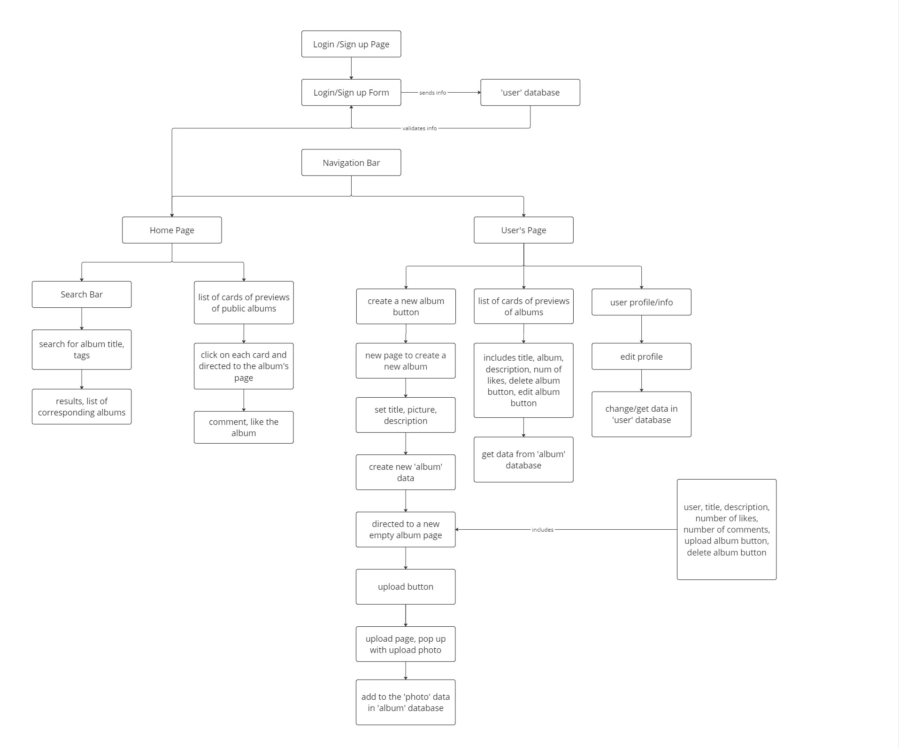
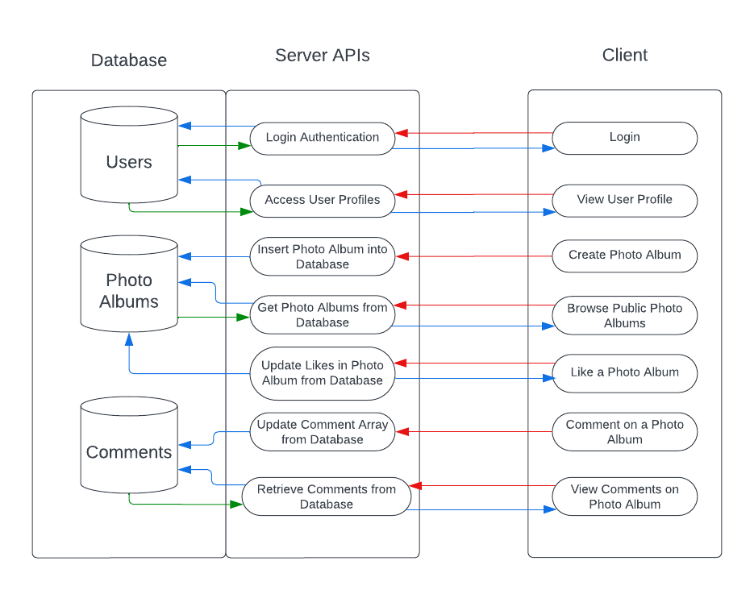

# YourMemories
Created By: James Nguyen, Sunghee Park, Roberto Raftery, Yan Remes

# Project Description
## Who is our target audience?
Our application is designed with a focus on young adults who cherish an abundance of photos, and would like to curate those photos into meaningful albums. We wanted to create an application where young adults are able to organize some of their most cherished memories – whether it’s capturing the moment of an exciting location or creating a commemorative album to a loved one who has recently passed away. No matter the type of memory, we wanted to make a simple application where users can easily organize and remember those special moments. 

In addition, we wanted to create a centralized hub where users can publically share their albums. We recognize that the transition from college into adulthood can be a rough and an isolating experience. Our application aims to be a source of connection for those experiencing difficulties. Not only will our web application allow users to publically share their memories, but also provides users the ability to engage through comments and likes. We believe that interactions through commenting and liking will aid in fostering a sense of community while simultaneously inspiring users to create further memories.

## Why does our audience want to use our application?
Our audience are young adults that are transitioning into the next phase of their lives  and are looking for a simple way to keep and share their favorite memories. They want a place where they can easily organize photos from life's big moments into albums, whether it's a fun trip or remembering someone special. Our platform offers a possibility to share photos publicly. People could engage with comments through likes and comments to help build a small community around memories. It is useful since once you become an adult it is hard to find new friends and in some cases people feel lonely. Our app is about keeping memories and making new friends along the way.

## Why do we as developers want to build this application?
Being college students ourselves, we recognize the challenges and isolation that can come with the transition from highschool to college, and onward into adulthood. Thus as developers, we are driven by a desire to address the emotional and social needs of young adults entering a new phase of life by providing a meaningful and user-friendly solution. 

We believe that a centralized hub where users can publicly share their photo albums can foster a sense of community. We plan on incorporating features like comments and likes, which will not only connect users who share similar interests or experiences but also encourage users to continue sharing their experiences, creating a cycle of ongoing engagement. We expect the application to become a source of creative ideas, prompting users to explore new places, try new activities, or capture moments in unique ways. Additionally, we would like to offer a simple way for users to organize their memories into online albums. We aim to provide a place to preserve and relive their cherished memories, whether they are related to exciting trips or commemorating important life events.

Overall, we hope to lessen potential loneliness that accompanies adulthood, and create a space for social interaction. By facilitating social interaction and engagement, we hope to create a virtual haven where users can connect with others undergoing similar life transitions, fostering a sense of shared experience and mutual support.

# Technical Description

## Architectural Diagrams

## Data Flow

## Summary Tables for User Stories

| Priority | User | Description | Technical Implementation |
|----------|------|-------------|--------------------------|
| P0 | As a user | I want to be able to create an account and log into/out of it. | When logging in, use Azure Authentication to authenticate users, and place them into our database. |
| P0 | As a user | I want to be able to create photo albums and give them a name. | When adding a new album, place the album into MongoDB with various attributes such as ‘photos. |
| P0 | As a user | I want to be able to upload photos into my albums. | When uploading photos, upload the photo onto Azure Storage, find the current album that the user is in, and store the Azure Storage blob links into MongoDB. |
| P0 | As a user | I want to be able to view my own photo albums | When viewing your own photo albums, retrieve all photo albums from the database that contains the user’s userID |
| P1 | As a user | I want to be able to view other photo albums | When viewing all public photo albums, retrieve all photo albums from the database. |
| P1 | As a user | I want to be able to comment and like different photo albums (mine and others) | When commenting and liking photos, retrieve specific photo albums from the database, and update comment and like fields in the database. |
| P1 | As a user | I want to be able to add a biography under my user profile | When adding a biography, retrieve the user and change the biography field in the database. |
| P1 | As a user | I want to be able to change the biography under my user profile | When changing a biography, retrieve the user and change the biography field in the database. |
| P2 | As a user | I want to be able to tag my photo albums | When adding tags, retrieve the selected photo album and add in tags to the database. |
| P2 | As a user | I want to be able to search for photo albums by name | When searching for albums, retrieve all photo albums from the database based on user input. |
| P2 | As a user | I want to be able to search for photos based on their tags | When searching for albums, filter photo albums from the database based tags. |

## API Endpoints:
GET /user/login - Allows users to log into their account. 

POST /user/register - Allows users to register for an account.

POST /album/create - Allows users to create photo albums.

GET /user/:id/profile - Allows users to view their own profile depending on an ID.

GET /album/view - Allows users to view public photo albums. 

POST /album/interaction - Updates like counter or comments for photo albums.

GET /album/:id - Allows users to view a specific photo album depending on an ID.

## Database Schemas:
- Users
    * userID (Number)
    * biography (String)
- Photo Albums
    * userID (Number)
    * albumID (Number)
    * title (String)
    * description (String)
    * photos (Array of Blob Links)
    * likes (Array of Strings)
    * tags (Array of Strings)
    * created_date (Date)
- Comments
    * userID (Number)
    * comment (String)
    * photo_album (object id of an Album)
    * created_date (Date)
 

